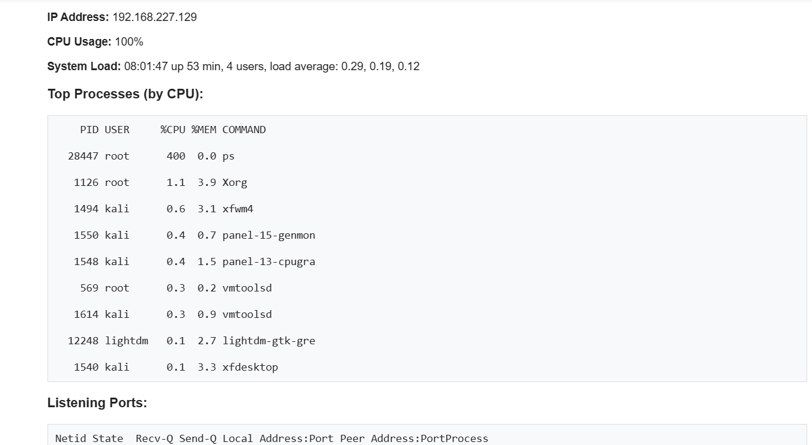
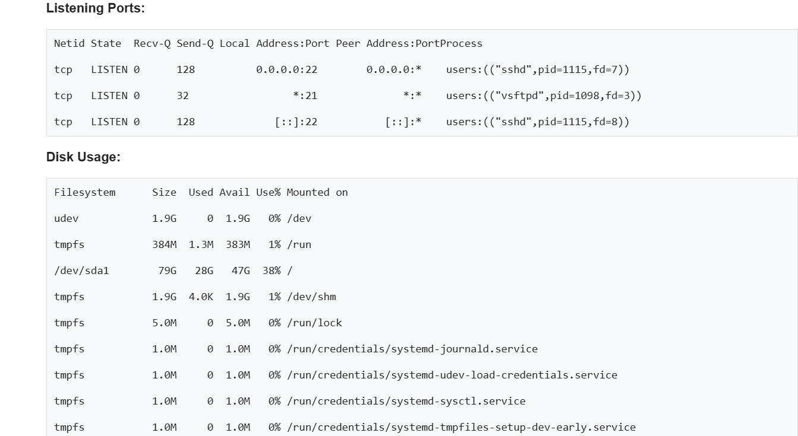
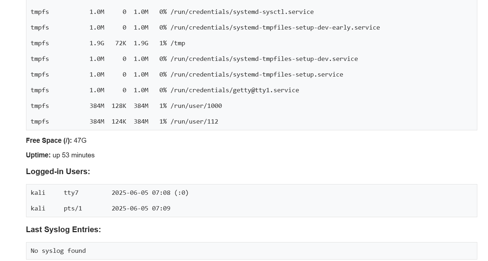

# 🖥️ Linux Resource Monitor & Email Alert System

[](https://opensource.org/licenses/MIT)
[](https://www.gnu.org/software/bash/)


[](https://github.com/svn23/resource-monitor/stargazers)

---

## 📄 Description

This project provides a **shell-based monitoring solution** for Linux systems to track system resources like CPU, memory, disk, and swap. When thresholds are exceeded, it sends **customized email alerts** to administrators.

It is ideal for sysadmins and DevOps engineers looking to implement lightweight monitoring without setting up full-scale solutions like Nagios or Zabbix.

---

## ✨ Features

✅ Monitors system health (CPU, RAM, Disk, Swap)  
✅ Configurable thresholds  
✅ Sends detailed HTML email alerts  
✅ Supports multiple email recipients  
✅ Easy setup via `install.sh`  
✅ Central configuration via `config.sh`

---

## 📁 File Structure
```
├── install.sh # One-click installer for dependencies and setup
├── config.sh # Configuration file with threshold values and emails
├── resource_monitor.sh # Core monitoring script
├── send_alert_email.sh # Sends HTML-based alert emails
├── Resource_Monitor_Documentation.docx # Documentation with visuals and explanations
└── README.md # You’re reading it!
```

---

## ⚙️ Setup

### 🔧 Requirements
- Linux OS (Tested on Ubuntu, RHEL)
- `mailutils` or compatible mail client
- Internet connectivity for sending alerts

### 🛠️ Installation

```bash
git clone https://github.com/your-username/resource-monitor.git
cd resource-monitor
chmod +x install.sh
./install.sh
```

This will:
* Install necessary packages
* Copy scripts to /usr/local/bin or a preferred location
* Create a cron job (optional) for periodic checks

---
## ✉️ Email Configuration
In config.sh, specify:
```bash
ADMIN_EMAILS="admin@example.com"
CPU_THRESHOLD=80
MEM_THRESHOLD=75
DISK_THRESHOLD=90
SWAP_THRESHOLD=60
```
You can configure multiple recipients by separating emails with a space.

---
## 🧪 Usage
Run the monitoring script manually:
```bash
./resource_monitor.sh
```
Or automate it with a cron job:
```bash
crontab -e
# Run every 15 minutes
*/15 * * * * /path/to/resource_monitor.sh
```
---

## 🖼️ Email Preview
The alert email includes:

- Hostname and timestamp
- A summary of exceeded resources
- Color-coded metrics
- Footer indicating auto-generation
### Below attached Screenshots



---
## 📚 Documentation
Refer to Resource_Monitor_Documentation.docx for:

- System diagram
- Flow logic
- Troubleshooting
- Enhancement ideas

## 🤝 Contributing
Contributions are welcome! Open issues or submit pull requests to improve the scripts, add logging, or support additional metrics.

## 📝 License
This project is licensed under the MIT License.

## 🌐 Author
Sovan Sen
IAM Developer | Linux Enthusiast | Security Learner

“Simplicity is the ultimate sophistication.” – Leonardo da Vinci

